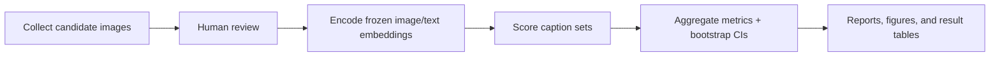

# ContextNegBench-Lite

[](https://github.com/FrancescoEPFL/ContextNegBench-Lite/actions/workflows/ci.yml)
[](https://github.com/FrancescoEPFL/ContextNegBench-Lite/releases/tag/v0.1.0)

A lightweight diagnostic study of CLIP-style vision-language models, testing when false object-specific negation can outrank true but underspecified descriptions.

## Overview

This repository studies a narrow image-text scoring failure mode in frozen CLIP-style embeddings. The core question is whether a caption that is logically false but names a salient visible object can score above a caption that is true but underspecified.

In short: false object-specific negation can often beat true generic captions, but it rarely beats the fully correct positive caption.

Best files to inspect after this README:

- [results/model_matrix_summary/summary.md](results/model_matrix_summary/summary.md)
- [docs/methodology.md](docs/methodology.md)
- [docs/limitations.md](docs/limitations.md)
- [scripts/run_model_matrix.py](scripts/run_model_matrix.py)

## Motivating Example

Image: a dog on grass

Core comparison:

A. `an image with no dog`

B. `an image of a grassy field`

A is false but object-specific: it names the visible object `dog`.

B is true but underspecified: it describes the scene but omits the salient object.

The diagnostic asks whether A can score higher than B.

As a separate control, the project also compares against the fully correct caption:

C. `an image of a dog on a grassy field`

This control usually remains top-ranked, which prevents the result from being misread as "false captions generally beat true captions."


## Key Result

The main diagnostic uses 74 reviewed dog/grass images. Two prompt pairs are reported:

- `core`: `an image with no dog` vs `an image of a grassy field`
- `field`: `a grassy field with no dog` vs `a grassy field`


Compact table: each value is `core / field`.

| model | false > generic | false > positive | positive top |
| --- | ---: | ---: | ---: |
| openclip_rn50 | 0.851 / 0.986 | 0.041 / 0.054 | 0.919 / 0.919 |
| openclip_vit_b16_openai | 0.757 / 0.986 | 0.081 / 0.054 | 0.892 / 0.946 |
| openclip_vit_b16_siglip | 0.973 / 0.986 | 0.081 / 0.014 | 0.905 / 0.959 |
| openclip_vit_b32 | 0.959 / 1.000 | 0.027 / 0.041 | 0.946 / 0.932 |
| openclip_vit_b32_datacomp | 0.770 / 0.973 | 0.068 / 0.135 | 0.851 / 0.784 |
| openclip_vit_b32_openai | 0.676 / 0.986 | 0.041 / 0.041 | 0.919 / 0.946 |

## Result Interpretation

The result should be read narrowly. It shows that object-specific wording can dominate a weak true caption in CLIP-style similarity scoring.

It does not show that false captions generally beat true captions. In the main diagnostic, the fully correct positive caption usually remains top-ranked.

The project isolates a specific scoring behavior under frozen embeddings and controlled caption choices.

Core claim:

```text
false object-specific negation can beat true underspecified descriptions
```

## Run in 2 Minutes

### No data or model downloads required

```bash
pip install -e ".[dev]"
python -m compileall src scripts
python -m pytest -q
python scripts/smoke_test.py
```

### Inspect public results

```bash
python scripts/reproduce_paper_tables.py --small
python scripts/reproduce_paper_tables.py --full
python scripts/validate_result_schemas.py
```

### Requires local reviewed images or model downloads

```bash
python scripts/run_dog_grass_false_negation_analysis.py \
  --root data/context_neg/dog_grass_false_negation \
  --model openclip_vit_b32 \
  --output results/dog_grass_false_negation \
  --bootstrap-samples 1000 \
  --batch-size 8
```

Full model-matrix reruns require reviewed local images and OpenCLIP/SigLIP weight downloads.

## What to Inspect First

1. [README.md](README.md): short narrative, key result, and reproduction path.
2. [results/model_matrix_summary/summary.md](results/model_matrix_summary/summary.md): compact frozen model-matrix summary.
3. [docs/methodology.md](docs/methodology.md): dataset construction, scoring, and aggregation details.
4. [docs/limitations.md](docs/limitations.md): scope and threats to validity.
5. [scripts/run_model_matrix.py](scripts/run_model_matrix.py): full experiment orchestration.
6. [src/negcompbench/eval/](src/negcompbench/eval/): metric and evaluation implementation.

## Project Status

| item | status |
| --- | --- |
| Version | `v0.1.0` research artifact |
| Scope | frozen-embedding diagnostic, not a production benchmark or leaderboard |
| Training | no training or fine-tuning |
| Intended use | low-compute evaluation and transparent result inspection |
| Small demo | reproducible from the public repo |
| Full experiment rerun | requires local reviewed images and model downloads |
| Latest CI | [workflow status](https://github.com/FrancescoEPFL/ContextNegBench-Lite/actions/workflows/ci.yml) |
| Frozen release | [v0.1.0](https://github.com/FrancescoEPFL/ContextNegBench-Lite/releases/tag/v0.1.0) |

## Main Entrypoints

| category | entrypoint | purpose |
| --- | --- | --- |
| Smoke test | `python scripts/smoke_test.py` | verify the public code path without model downloads |
| Public result validation | `python scripts/reproduce_paper_tables.py --full` | regenerate summary tables from frozen CSVs |
| Schema validation | `python scripts/validate_result_schemas.py` | check public result table schemas |
| Core dog/grass diagnostic | `scripts/run_dog_grass_false_negation_analysis.py` | rerun the main diagnostic with reviewed local images |
| Supporting diagnostics | `scripts/run_final_contextneg_analysis.py` | rerun with/without scenario analyses |
| Model matrix | `scripts/run_model_matrix.py` | orchestrate multi-model analyses |
| Aggregation | `scripts/aggregate_model_matrix.py` | aggregate per-model result folders |
| Methodology | `docs/methodology.md` | dataset, scoring, and bootstrap procedure |
| Limitations | `docs/limitations.md` | scope and threats to validity |
| Results summary | `results/model_matrix_summary/summary.md` | compact public summary of frozen results |

## Methodology Overview

The pipeline is:



Models tested:

- `openclip_vit_b32`
- `openclip_vit_b32_openai`
- `openclip_vit_b32_datacomp`
- `openclip_vit_b16_openai`
- `openclip_vit_b16_siglip`
- `openclip_rn50`

The public repository includes code, docs, frozen summary tables, selected figures, schema validation, CI, and a small generated CC0 demo dataset in [data/sample_synthetic/](data/sample_synthetic/).

The public demo is for pipeline verification, not evidence for the main research claim. More detail is in [docs/methodology.md](docs/methodology.md) and [docs/metrics.md](docs/metrics.md).

## Supporting Diagnostics

Supporting analyses are included to show that the effect is prompt-, model-, and scenario-dependent:

- detailed-generic control: the effect weakens when the true caption becomes more specific.
- with/without scenarios: `kitchen_table`, `street_car`, `cat_sofa`, `person_beach`, and `bicycle_street`.
- text-space negation delta consistency: absence-like templates form partially structured text-space directions.
- logical connector probes and lexical-bias baselines.

Full supporting tables are in [docs/results_summary.md](docs/results_summary.md), [results/model_matrix_summary/](results/model_matrix_summary/), [docs/prompt_sensitivity.md](docs/prompt_sensitivity.md), and [docs/lexical_bias_baselines.md](docs/lexical_bias_baselines.md).

## Reproduction Details

Install dependencies:

```bash
python -m pip install -r requirements.txt
```

Validate the public artifact:

```bash
python -m compileall src scripts
python -m ruff check src scripts tests
python -m ruff format --check src scripts tests
python -m mypy src/negcompbench/eval/schema_validation.py scripts/reproduce_paper_tables.py scripts/validate_result_schemas.py
python -m pytest -q
python scripts/validate_result_schemas.py
python scripts/reproduce_paper_tables.py --full
python scripts/reproduce_paper_tables.py --small
```

Rerun the dog/grass diagnostic after recreating reviewed local data:

```bash
python scripts/run_dog_grass_false_negation_analysis.py \
  --root data/context_neg/dog_grass_false_negation \
  --model openclip_vit_b32 \
  --output results/dog_grass_false_negation \
  --bootstrap-samples 1000 \
  --batch-size 8
```

More commands are in [docs/runbook.md](docs/runbook.md).

## Repository Map

```text
README.md
PROJECT_CARD.md
CHANGELOG.md
ROADMAP.md
docs/
  index.md
  methodology.md
  metrics.md
  results_summary.md
scripts/
  README.md
src/
tests/
results/
  README.md
  model_matrix_summary/
  selected_figures/
```

## Limitations

- The main dog/grass dataset has 74 reviewed images, so it is a diagnostic set, not a large benchmark.
- Reviewed web images are not redistributed; full reruns require recreating and manually reviewing local datasets.
- Results are prompt-sensitive. Full prompt-pair rows are kept in the public CSVs.
- The model family is limited to CLIP-style contrastive encoders through OpenCLIP presets.
- These experiments measure scoring behavior, not causal model internals.
- The synthetic sample dataset is only a pipeline demo.

More detail is in [docs/limitations.md](docs/limitations.md).
