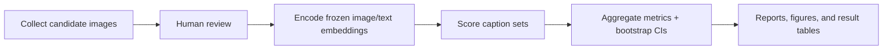

# When False Negation Beats Partial Truth: Object Specificity in CLIP Image-Text Matching

[](https://github.com/FrancescoEPFL/ContextNegBench-Lite/actions/workflows/ci.yml)
[](https://github.com/FrancescoEPFL/ContextNegBench-Lite/releases/tag/v0.1.0)

**ContextNegBench-Lite is a small diagnostic evaluation artifact for CLIP-style image-text scoring.**

It asks whether a false negated caption that names a visible object can outrank a true but underspecified caption.


## What This Project Shows

A false caption such as `an image with no dog` can outrank a true but underspecified caption such as `an image of a grassy field`, because the false caption still names the visible object.

This does **not** mean false captions generally beat true captions. In the main dog/grass diagnostic, the fully correct positive caption usually remains top-ranked.

Core claim:

```text
false object-specific negation can beat true underspecified descriptions
```

## For Recruiters / Reviewers: Run In 2 Minutes

No model download and no web data are required for the quick path:

```powershell
python scripts/smoke_test.py
python scripts/reproduce_paper_tables.py --small
python scripts/reproduce_paper_tables.py --full
python scripts/validate_result_schemas.py
```

What to inspect first:

- [PROJECT_CARD.md](PROJECT_CARD.md): one-page summary of what was built and what skills it demonstrates.
- [results/model_matrix_summary/summary.md](results/model_matrix_summary/summary.md): compact frozen result summary.
- [results/full_research_report.md](results/full_research_report.md): complete narrative report.
- [scripts/README.md](scripts/README.md): main entrypoints by task.
- [results/README.md](results/README.md): result folder guide.

Status:

| item | status |
| --- | --- |
| Project status | `v0.1.0` research artifact |
| Fully reproducible small demo | yes |
| Public result validation | yes |
| Full experiment rerun from this repo alone | partial; reviewed web images are not redistributed |
| Latest CI | [success](https://github.com/FrancescoEPFL/ContextNegBench-Lite/actions/workflows/ci.yml) |
| Frozen release | [v0.1.0](https://github.com/FrancescoEPFL/ContextNegBench-Lite/releases/tag/v0.1.0) |

## Key Result

Main diagnostic: 74 reviewed images of dogs visible on grass. Two prompt pairs are shown:

- `core`: `an image with no dog` vs `an image of a grassy field`
- `field`: `a grassy field with no dog` vs `a grassy field`


Compact table: each value is `core / field`.

| model | false > generic | false > positive | positive top |
| --- | ---: | ---: | ---: |
| openclip_rn50 | 0.851 / 0.986 | 0.041 / 0.054 | 0.919 / 0.919 |
| openclip_vit_b16_openai | 0.757 / 0.986 | 0.081 / 0.054 | 0.892 / 0.946 |
| openclip_vit_b16_siglip | 0.973 / 0.986 | 0.081 / 0.014 | 0.905 / 0.959 |
| openclip_vit_b32 | 0.959 / 1.000 | 0.027 / 0.041 | 0.946 / 0.932 |
| openclip_vit_b32_datacomp | 0.770 / 0.973 | 0.068 / 0.135 | 0.851 / 0.784 |
| openclip_vit_b32_openai | 0.676 / 0.986 | 0.041 / 0.041 | 0.919 / 0.946 |

Interpretation:

- The false negated caption often beats the true generic caption.
- It rarely beats the fully correct positive caption.
- The result is not `false beats truth`; it is `false object-specific negation can beat underspecified truth`.

## What This Does Not Claim

This project does not claim that CLIP never understands negation.

It does not claim that CLIP is purely bag-of-words.

It does not claim that false captions generally beat true captions.

The claim is narrower: false negated captions that mention a visible object can outrank true but underspecified captions in diagnostic settings.

## Project Shape

This is a diagnostic study, not a benchmark leaderboard. No model is trained. All experiments use frozen image/text embeddings and caption scores from CLIP-style models.

Models tested:

- `openclip_vit_b32`
- `openclip_vit_b32_openai`
- `openclip_vit_b32_datacomp`
- `openclip_vit_b16_openai`
- `openclip_vit_b16_siglip`
- `openclip_rn50`

Core experiment:

- dog/grass false-negation diagnostic

Supporting analyses:

- with/without scenarios: `kitchen_table`, `street_car`, `cat_sofa`, `person_beach`, `bicycle_street`
- detailed-generic control
- text-space negation delta consistency
- logical connector embedding probes
- lexical-bias baseline for caption length and object-word overlap

## Reviewer Entry Points

| task | command or file |
| --- | --- |
| Smoke test | `python scripts/smoke_test.py` |
| Small demo | `python scripts/reproduce_paper_tables.py --small` |
| Validate frozen tables | `python scripts/reproduce_paper_tables.py --full` |
| Validate result schemas | `python scripts/validate_result_schemas.py` |
| Dog/grass analysis | `scripts/run_dog_grass_false_negation_analysis.py` |
| Model matrix | `scripts/run_model_matrix.py` |
| Result overview | `results/model_matrix_summary/summary.md` |
| Full report | `results/full_research_report.md` |
| Script guide | `scripts/README.md` |
| Docs index | `docs/index.md` |

## Methodology In Brief

The pipeline is:



The public repository includes code, docs, frozen summary tables, selected figures, schema validation, CI, and a small generated CC0 demo dataset in [data/sample_synthetic/](data/sample_synthetic/).

Downloaded/reviewed web image folders are not committed. The public demo is for pipeline verification, not evidence for the main research claim.

## Supporting Results

Detailed-generic control:

| model | false > detailed generic | false > generic | positive top |
| --- | ---: | ---: | ---: |
| openclip_rn50 | 0.662 | 0.919 | 0.919 |
| openclip_vit_b16_openai | 0.676 | 0.872 | 0.919 |
| openclip_vit_b16_siglip | 0.547 | 0.980 | 0.932 |
| openclip_vit_b32 | 0.655 | 0.980 | 0.939 |
| openclip_vit_b32_datacomp | 0.588 | 0.872 | 0.818 |
| openclip_vit_b32_openai | 0.547 | 0.831 | 0.932 |

Scenario dependence:

| scenario | false_negative_top_rate | mean_false_absence_tolerance | positive_top_rate |
| --- | ---: | ---: | ---: |
| bicycle_street | 0.500 | 0.055 | 0.491 |
| cat_sofa | 0.275 | 0.070 | 0.721 |
| kitchen_table | 0.260 | 0.024 | 0.721 |
| person_beach | 0.089 | 0.011 | 0.867 |
| street_car | 0.210 | 0.016 | 0.749 |

Text-only negation structure:

| operator | mean_delta_direction_similarity |
| --- | ---: |
| no | 0.7392 |
| without | 0.7692 |
| with no | 0.6833 |
| without any | 0.7967 |
| no visible | 0.8330 |
| absent | 0.7932 |
| not a | 0.8149 |

Full tables are in [docs/results_summary.md](docs/results_summary.md) and [results/model_matrix_summary/](results/model_matrix_summary/).

## Known Limitations

- The main dog/grass dataset has 74 reviewed images, so it is a diagnostic set, not a large benchmark.
- Reviewed web images are not redistributed; full reruns require recreating and manually reviewing local datasets.
- Results are prompt-sensitive. Full prompt-pair rows are kept in the public CSVs.
- The model family is limited to CLIP-style contrastive encoders through OpenCLIP presets.
- These experiments measure scoring behavior, not causal model internals.
- The synthetic sample dataset is only a pipeline demo.

More detail is in [docs/limitations.md](docs/limitations.md), [docs/prompt_sensitivity.md](docs/prompt_sensitivity.md), and [docs/lexical_bias_baselines.md](docs/lexical_bias_baselines.md).

## Reproduction

Install dependencies:

```powershell
python -m pip install -r requirements.txt
```

Validate the public artifact:

```powershell
python -m compileall src scripts
python -m ruff check src scripts tests
python -m ruff format --check src scripts tests
python -m mypy src/negcompbench/eval/schema_validation.py scripts/reproduce_paper_tables.py scripts/validate_result_schemas.py
python -m pytest -q
python scripts/validate_result_schemas.py
python scripts/reproduce_paper_tables.py --full
python scripts/reproduce_paper_tables.py --small
```

Rerun the dog/grass diagnostic after recreating reviewed local data:

```powershell
python scripts/run_dog_grass_false_negation_analysis.py `
  --root data/context_neg/dog_grass_false_negation `
  --model openclip_vit_b32 `
  --output results/dog_grass_false_negation `
  --bootstrap-samples 1000 `
  --batch-size 8
```

More commands are in [docs/runbook.md](docs/runbook.md).

## Repository Map

```text
README.md
PROJECT_CARD.md
CHANGELOG.md
ROADMAP.md
docs/
  index.md
  methodology.md
  metrics.md
  results_summary.md
scripts/
  README.md
src/
tests/
results/
  README.md
  model_matrix_summary/
  selected_figures/
```
