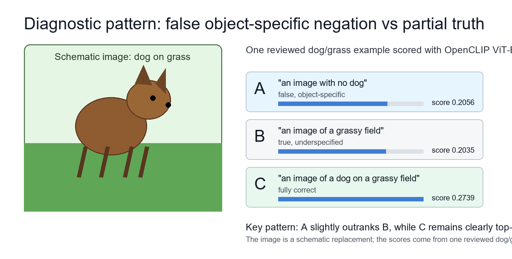
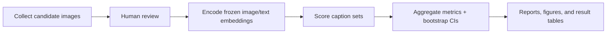

# When False Negation Beats Partial Truth: Object Specificity in CLIP Image-Text Matching

[](https://github.com/FrancescoEPFL/ContextNegBench-Lite/actions/workflows/ci.yml)

**A low-compute semantic embedding analysis of negation, object specificity, and logical connectors in CLIP-style models.**



## Abstract

CLIP-style models embed images and text into a shared vector space, then compare image-text similarity. Prior work has shown that these models can struggle with negation and compositional meaning, especially when small linguistic changes reverse the truth of a caption.

This project asks a narrower question: can a false negated caption that names a visible object score above a true but underspecified caption? For example, if an image contains a dog on grass, `an image with no dog` is false but contains the salient object word `dog`, while `an image of a grassy field` is true but incomplete.

The main result is yes: across several CLIP-style models in a dog-on-grass diagnostic, false object-specific negation often beats true generic partial descriptions. However, the fully correct positive caption usually remains top-ranked. The result is therefore not "false beats truth"; it is a more specific failure mode where object specificity can overpower weakly grounded absence semantics.

## Motivating Example

Image: a dog on grass

Captions:

A. `an image with no dog`  
B. `an image of a grassy field`  
C. `an image of a dog on a grassy field`

A is false but object-specific. B is true but incomplete. C is fully correct. This project tests whether A can beat B, and whether C still beats both.

## Research Questions

- Are affirmative and negated captions close in CLIP text embedding space?
- Can false object-specific negation beat true generic partial descriptions?
- Does the effect persist across multiple CLIP-style models?
- Does the effect weaken when the true caption becomes more detailed?
- Are negation and logical connectors represented as structured text-space directions?
- Do image-side object separability and scenario choice affect behavior?

## Methodology

No model is trained. All experiments use frozen embeddings and image-text scores from CLIP-style models. This is a diagnostic study, not a benchmark leaderboard.

Models tested:

- `openclip_vit_b32`
- `openclip_vit_b32_openai`
- `openclip_vit_b32_datacomp`
- `openclip_vit_b16_openai`
- `openclip_vit_b16_siglip`
- `openclip_rn50`

Main diagnostic:

- `dog_grass_false_negation`: 74 reviewed images of dogs visible on grass.

Supporting with/without scenarios:

- `kitchen_table`
- `street_car`
- `cat_sofa`
- `person_beach`
- `bicycle_street`

Text-only analyses:

- negation delta consistency
- logical connector embeddings

See [docs/methodology.md](docs/methodology.md) for dataset creation, human review, scoring, and confidence interval details.

## What A Reviewer Should Notice

- Research question: a narrow diagnostic for false object-specific negation, not a broad claim that CLIP "does not understand negation."
- Pipeline: collect/review images, encode frozen image/text embeddings, score caption sets, aggregate prompt-pair metrics, report limitations.
- Model matrix: the main dog/grass result is checked across six CLIP-style model presets.
- Controls: fully correct positive captions usually stay top-ranked, and detailed generic captions weaken the false-negation effect.
- Reproducibility stance: web datasets are not redistributed, but summary tables, figures, code, tests, CI, and a license-safe synthetic demo are included.

## Key Metrics

`false_negated_win_rate_over_generic`: rate at which a false negated caption beats a true but generic caption.

`false_negated_win_rate_over_detailed_generic`: same comparison, but the true caption is strengthened, for example with `with an animal`.

`false_negated_win_rate_over_positive`: rate at which the false negated caption beats the fully correct positive caption.

`top_positive_rate`: rate at which the fully correct positive caption is top-ranked.

`mean_false_absence_tolerance`: for with-object images, `score(scene without object) - score(scene)`.

`image_condition_separation`: distance between with-object and without-object image centroids in image embedding space.

`delta_direction_similarity`: how consistently an operator transformation like `embedding("no X") - embedding("X")` points in a similar direction across objects.

Detailed metric definitions are in [docs/metrics.md](docs/metrics.md).

## Main Result: Dog/Grass False Negation

This is the cleanest stress test in the project. The false negated caption is logically wrong, but it names the visible object. The generic caption is true but incomplete.

Prompt-pair labels:

- `core`: `an image with no dog` vs `an image of a grassy field`
- `field`: `a grassy field with no dog` vs `a grassy field`


| model | core_false_negated_over_generic | field_false_negated_over_generic | core_false_negated_over_positive | field_false_negated_over_positive | core_top_positive_rate | field_top_positive_rate |
| --- | ---: | ---: | ---: | ---: | ---: | ---: |
| openclip_rn50 | 0.851 | 0.986 | 0.041 | 0.054 | 0.919 | 0.919 |
| openclip_vit_b16_openai | 0.757 | 0.986 | 0.081 | 0.054 | 0.892 | 0.946 |
| openclip_vit_b16_siglip | 0.973 | 0.986 | 0.081 | 0.014 | 0.905 | 0.959 |
| openclip_vit_b32 | 0.959 | 1.000 | 0.027 | 0.041 | 0.946 | 0.932 |
| openclip_vit_b32_datacomp | 0.770 | 0.973 | 0.068 | 0.135 | 0.851 | 0.784 |
| openclip_vit_b32_openai | 0.676 | 0.986 | 0.041 | 0.041 | 0.919 | 0.946 |

The false negated caption often beats the true generic caption. It rarely beats the fully correct positive caption. Therefore the result is not "false beats truth." The correct claim is:

```text
false object-specific negation can beat true underspecified descriptions
```

## Why The Control Matters

When the true caption is made more detailed, for example by mentioning `animal`, the false-negation effect weakens in several models and prompt forms. This control prevents overclaiming: the failure is strongest when the true caption is generic or underspecified.

The table averages the `core` and `field` dog/grass prompt pairs.

| model | false_negated_over_detailed_generic | false_negated_over_generic | top_positive_rate |
| --- | ---: | ---: | ---: |
| openclip_rn50 | 0.662 | 0.919 | 0.919 |
| openclip_vit_b16_openai | 0.676 | 0.872 | 0.919 |
| openclip_vit_b16_siglip | 0.547 | 0.980 | 0.932 |
| openclip_vit_b32 | 0.655 | 0.980 | 0.939 |
| openclip_vit_b32_datacomp | 0.588 | 0.872 | 0.818 |
| openclip_vit_b32_openai | 0.547 | 0.831 | 0.932 |

The generic comparison is consistently high. The detailed-generic comparison is lower, but still non-trivial for several models. This suggests that object-specific false negation is most competitive when the true alternative caption omits the salient object or a close visual category.

## Supporting Diagnostics: Scenario Dependence

The with/without scenarios show that behavior depends on object, scene, model, and prompt wording. This section is supporting evidence, not the central result.

| scenario | false_negative_top_rate | mean_false_absence_tolerance | positive_top_rate |
| --- | ---: | ---: | ---: |
| bicycle_street | 0.500 | 0.055 | 0.491 |
| cat_sofa | 0.275 | 0.070 | 0.721 |
| kitchen_table | 0.260 | 0.024 | 0.721 |
| person_beach | 0.089 | 0.011 | 0.867 |
| street_car | 0.210 | 0.016 | 0.749 |

`person_beach` is the cleanest scenario on average. `bicycle_street` is harder. `kitchen_table` is strongly model-dependent. This supports the idea that the failure mode is not universal or fixed; it depends on model, scenario, and prompt wording.

## Image-Side Separability

Image-side separability varies strongly by scenario and model. It helps interpret behavior, but it is not sufficient by itself. For example, `cat_sofa` can have high with/without image separation while still showing false absence tolerance.

Full image condition separation tables are in [docs/results_summary.md](docs/results_summary.md).

## Text-Only Embedding Analysis

We also tested whether negation is pure noise in text space by checking whether:

```text
embedding("no dog") - embedding("dog")
~= embedding("no cat") - embedding("cat")
~= embedding("no car") - embedding("car")
```

| operator | mean_delta_direction_similarity |
| --- | ---: |
| no | 0.7392 |
| without | 0.7692 |
| with no | 0.6833 |
| without any | 0.7967 |
| no visible | 0.8330 |
| absent | 0.7932 |
| not a | 0.8149 |

Negation is not pure noise: operator directions are partially structured. But these directions do not behave as hard logical constraints in image-text scoring. `no visible X` is the most consistent tested absence-like template.

Detailed negation-delta results are in [docs/appendix_negation_delta.md](docs/appendix_negation_delta.md). Logical connector results are in [docs/appendix_logical_connectors.md](docs/appendix_logical_connectors.md).

## Main Conclusion

These diagnostics identify a repeatable scoring failure mode where salient object mentions can overpower weakly grounded absence semantics, especially when the true alternative caption is generic or underspecified.

## What This Does Not Claim

This project does not claim that CLIP never understands negation. It does not claim that CLIP is purely bag-of-words. It does not claim that false captions generally beat true captions.

The claim is narrower: false negated captions that mention a visible object can outrank true but underspecified captions in diagnostic settings.

## Data Policy

Downloaded images are not committed by default. Users can recreate candidate datasets with the provided scripts, but human review is required before running the analyses. Web data may contain noise, ambiguous labels, duplicates, watermarks, or licensing constraints.

The repository keeps scripts, metadata conventions, selected result CSVs, and selected figures. Local `raw/`, `reviewed/`, `metadata/`, and review-gallery files are ignored by default.

The folder [data/sample_synthetic/](data/sample_synthetic/) contains a small generated CC0 demo dataset for smoke tests and pipeline checks. It is not used for the main research result.

Precomputed summary reports are available in [results/model_matrix_summary/](results/model_matrix_summary/).

The full narrative report is available at [results/full_research_report.md](results/full_research_report.md).

Release notes for the frozen public snapshot are in [docs/release_v0.1.0.md](docs/release_v0.1.0.md).

## Reviewer Quick Path

Fast path, no model download and no web data:

```powershell
python scripts/smoke_test.py
python scripts/reproduce_paper_tables.py --small
python scripts/validate_result_schemas.py
```

Status:

| item | status |
| --- | --- |
| Fully reproducible small demo | yes |
| Full experiment reproducible from this repo alone | partially, because reviewed web images are not redistributed |
| Public result validation | yes |
| Frozen result summaries included | yes |
| CI checks compile, tests, lint, type checks, schema validation, and small/full reproduction helpers | yes |

What each path requires:

| path | command | expected time | needs GPU | needs reviewed web data | output |
| --- | --- | ---: | --- | --- | --- |
| Smoke test | `python scripts/smoke_test.py` | < 1 min | no | no | temporary synthetic run |
| Small demo | `python scripts/reproduce_paper_tables.py --small` | ~1-2 min | no | no | `results/sample_synthetic_demo/` |
| Frozen tables | `python scripts/reproduce_paper_tables.py --full` | < 1 min | no | no | result hashes and schema checks |
| Main dog/grass rerun | `python scripts/run_dog_grass_false_negation_analysis.py ...` | minutes to hours | recommended | yes | full dog/grass metrics |
| Model matrix | `python scripts/run_model_matrix.py ...` | hours on CPU | recommended | yes | multi-model result folders |

CI status is visible in the badge above and in the latest [GitHub Actions runs](https://github.com/FrancescoEPFL/ContextNegBench-Lite/actions/workflows/ci.yml).

## Quick Start

Run a lightweight smoke test without downloading model weights or web images:

```powershell
python scripts/smoke_test.py
```

Run the main dog/grass diagnostic with the default OpenCLIP ViT-B/32 model:

```powershell
python scripts/run_dog_grass_false_negation_analysis.py `
  --root data/context_neg/dog_grass_false_negation `
  --model openclip_vit_b32 `
  --output results/dog_grass_false_negation `
  --bootstrap-samples 1000 `
  --batch-size 8
```

## How To Reproduce Table 1

Table 1 in this README is the dog/grass model-matrix table. The frozen public CSV can be validated and fingerprinted without downloading images:

```powershell
python scripts/reproduce_paper_tables.py --full
```

To recompute it from scratch, recreate and review the dog/grass dataset, then run:

```powershell
python scripts/run_model_matrix.py `
  --models openclip_vit_b32 openclip_vit_b32_openai openclip_vit_b32_datacomp openclip_rn50 openclip_vit_b16_openai openclip_vit_b16_siglip `
  --analyses dog_grass `
  --output-root results/model_matrix `
  --bootstrap-samples 1000 `
  --batch-size 8

python scripts/aggregate_model_matrix.py `
  --root results/model_matrix `
  --output results/model_matrix_summary
```

## Reproduction

Install dependencies:

```powershell
python -m pip install -r requirements.txt
python -m pip install ddgs
```

Build or refresh the human sanity table:

```powershell
python scripts/build_human_sanity_table.py `
  --scenarios kitchen_table street_car cat_sofa person_beach bicycle_street `
  --output results/human_sanity_table.csv
```

Run the dog/grass diagnostic:

```powershell
python scripts/run_dog_grass_false_negation_analysis.py `
  --root data/context_neg/dog_grass_false_negation `
  --model openclip_vit_b32 `
  --output results/dog_grass_false_negation `
  --bootstrap-samples 1000 `
  --batch-size 8
```

Run the with/without scenario analysis:

```powershell
python scripts/run_final_contextneg_analysis.py `
  --scenarios kitchen_table street_car cat_sofa person_beach bicycle_street `
  --model openclip_vit_b32 `
  --output results/final_contextneg_analysis `
  --bootstrap-samples 1000 `
  --batch-size 8
```

Run the model matrix:

```powershell
python scripts/run_model_matrix.py `
  --models openclip_vit_b32 openclip_vit_b32_openai openclip_vit_b32_datacomp openclip_rn50 openclip_vit_b16_openai openclip_vit_b16_siglip `
  --analyses final dog_grass `
  --scenarios kitchen_table street_car cat_sofa person_beach bicycle_street `
  --output-root results/model_matrix `
  --bootstrap-samples 1000 `
  --batch-size 8
```

Aggregate the model matrix:

```powershell
python scripts/aggregate_model_matrix.py `
  --root results/model_matrix `
  --output results/model_matrix_summary
```

Run tests:

```powershell
python -m compileall src scripts
python -m pytest -q
```

More collection and run commands are in [docs/runbook.md](docs/runbook.md).

## Pipeline



## Known Failure Cases

- Prompt wording matters: `no visible X`, `without X`, and `with no X` are not interchangeable.
- Scenario choice matters: `person_beach` is cleaner than `bicycle_street`, while `kitchen_table` is strongly model-dependent.
- True-but-generic captions are vulnerable; true detailed-generic captions reduce the effect.
- The text-space negation direction is structured, but image-text ranking does not treat it as a hard logical constraint.

## Known Limitations

- The main dog/grass dataset has 74 reviewed images, so it is a diagnostic set, not a large benchmark.
- Reviewed web images are not redistributed for licensing reasons; full reruns require recreating and manually reviewing local datasets.
- Results are prompt-sensitive. The project reports multiple prompt forms and keeps full prompt-pair rows in the public CSVs.
- The model family is limited to CLIP-style contrastive encoders through OpenCLIP presets.
- These experiments measure scoring behavior, not causal model internals.
- The synthetic sample dataset is only a pipeline demo; it is not evidence for the main research claim.

More detail is in [docs/limitations.md](docs/limitations.md), [docs/prompt_sensitivity.md](docs/prompt_sensitivity.md), and [docs/lexical_bias_baselines.md](docs/lexical_bias_baselines.md).

## Repository Map

```text
README.md
docs/
  methodology.md
  metrics.md
  results_summary.md
  limitations.md
  appendix_logical_connectors.md
  appendix_negation_delta.md
scripts/
notebooks/
src/
tests/
results/
  model_matrix_summary/
  dog_grass_false_negation/
  final_contextneg_analysis/
  negation_delta_consistency/
  logical_connector_embeddings/
  selected_figures/
```
